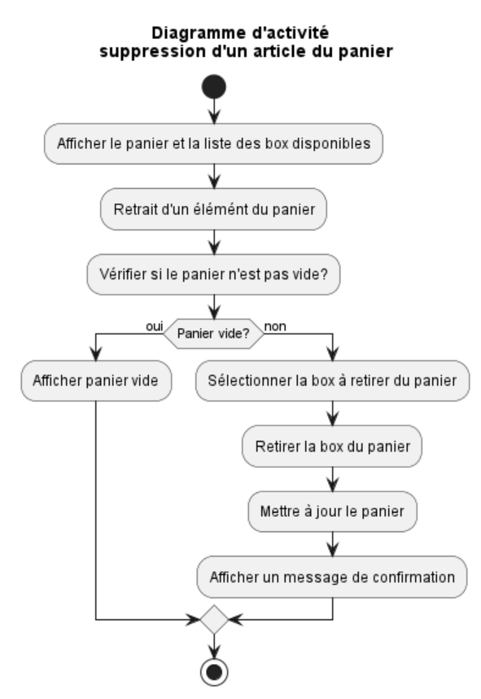

= SushiFastSQM
:author: Quentin AYRAL, Sekou TRAORE, Mathieu MORGADO MARTA
:docdate: 2023-04-02
:asciidoctor-version:1.2
:toc-title: Table des matières
:toc: left
:toclevels: 4
:description: Projet n°2 Sushi Fast Typescript - Angular

== Présentation
Projet réalisé par Quentin AYRAL, Sekou TRAORE et Mathieu MORGADO MARTA rendu le 2 avril 2023.

== Sommaire

== Thème

Réaliser une application Web front-end de prise de commande de Menus/Box au niveau d'un point de vente de sushi grâce à une API et le Framework Angular

<<<
== Analyse

'''

=== 1.1 : Diagramme des cas d'utilisations

'''

=== 1.2 : Diagramme des différents tiers

<<<
=== 1.3 : Maquette de l'interface Web

'''

<<<
=== 1.4 : Diagramme d'activité possible

Le format ci-dessus présente la suppression d'un article du panier.

'''
<<<
=== 1.5 : Structure JSON du panier
----
[
    {
        "id": <l'id de la commande>,
        "prix": <prix total de la commande>,
        "nbTotalBox": <nombre total de box>,
        "articles": [
            {
                "nom": "<nom de la box>",
                "quantite": <quantite de box demandé>
            },
            {
                "nom": "<nom de la box>",
                "quantite": <quantite de box demandé>
            }
        ]
    }
]
----

Le format ci-dessus présente un panier contenant 2 box différentes.

'''
<<<
== Implémentation

'''
=== 2.1 RGPD :

Nous avons décidé afin d'être le plus transparent possible, de renvoyer l'utilisateur, si ce dernier le souhaite, sur le site de la CNIL via le lien cliquable en bas de page "Notre politique de confidentialit&eacute;".

---
=== 2.2 Sélection de copies écran :

Ajout au panier :

Les boutons "Ajouter" visible sur la partie gauche de l'interface renvoient à cette fonction qui ajoute une box dans le panier et vérifie qu'il y a moins de 10 boxs dans ce dernier.

Détails des boxes :

Pour visualiser les détails d'une box, nous avons ajouté pour chacune d'entre elles un lien donnant lieu à un pop-up indiquant composants de la box demandée :

Tout cela est géré dans le code `html` du menu, soit `menu.component.html` :

---
<<<
=== 2.3 Cybersécurité :

1 -  En tant que personne malveillante, je veux empêcher l’API de fonctionner en réalisant une attaque en réalisant un nombre important de requêtes à cette dernière.

En tant que développeur, nous définissons une limite d'ajout dans le panier afin d'empêcher un trop grand nombre de requêtes simultanées :

Voici le résultat obtenu en cas de tentative d'ajout au dessus de 10 articles :

2 - En tant que personne malveillante, je veux empêcher l'API de fonctionner en ouvrant des paniers sans en valider la commande.

En tant que développeur, nous définissons une limite de temps de dix minutes pour un panier qui se réinitialise lorsqu'un article est ajouté ou supprimé du panier.

---
<<<
== Conclusion

=== 3.1 Résumé de l'objectif :

Notre objectif était d'avoir une application fonctionnelle en lien avec une API, ce qui a été réalisé.

=== 3.2 Résumé des résultats :

Nous sommes dans l'ensemble satisfait du résultat de notre application, le projet était compliqué quant à l'acquisition des données de l'API, cependant des solutions ont été trouvées.

=== 3.3 Résumé de l'expérience :

Nous avons su gérer notre temps, le projet en lui-même était réalisable rapidement, cependant nous nous sommes heurtés à plusieurs freins qui nous prirent parfois plusieurs jours de développement et essais.

=== 3.4 Perspectives d'avenir :

Nous pourrions implémenter un système de log et améliorer l'interface utilisateur, de façon à rendre cette dernière plus agréable.

---

== Lien vers nos dépôts :
https://github.com/MorgadoMathieu/SushiShopSQM/tree/master

https://github.com/ThomasKsK/sushifast

== Lien vers notre projet déployé : 
https://deploiment-sushifast.web.app
